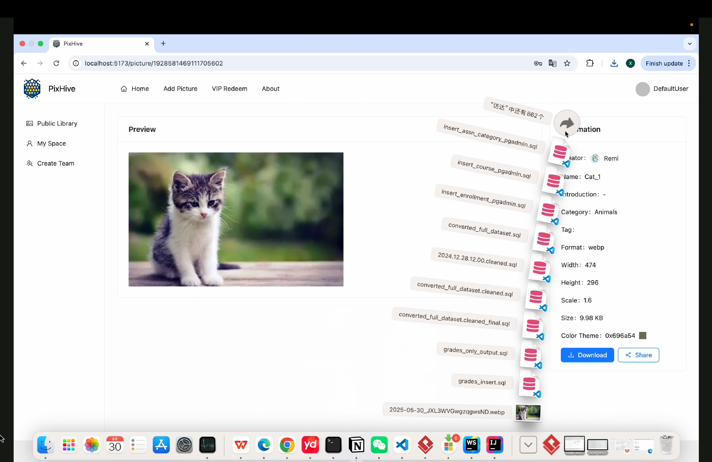
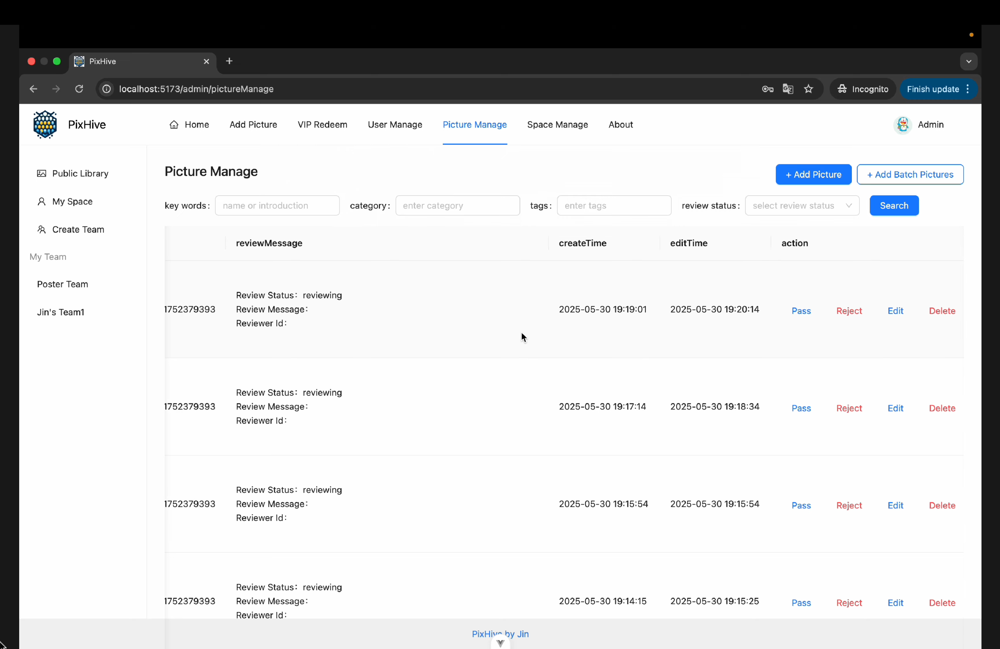

# PixHive

## 🐝 Introduction

**PixHive** is an enterprise-grade intelligent collaborative cloud image library platform built with **Vue 3**, **Spring Boot**, **COS**, and **WebSocket**. It supports diverse use cases such as meme repositories, design asset libraries, wallpaper collections, personal cloud storage, and corporate event albums.

## 🌐 Live Demo

[](https://youtu.be/17awE2DT1ys)


## ✨ Features

- 🖼️ **Public Image Library**: Users can upload and search public images.
- 🔐 **Private Spaces**: Personal users can upload, retrieve, edit, and manage images privately.
- 👥 **Team Collaboration**: Enterprises can create team spaces, invite members, and collaborate in real time.
- 🧑‍💼 **Admin Tools**: Admins can upload, review, approve, and analyze image content.
- ⚡ **Batch Operations**: Efficient batch image management and processing.
- 🤝 **Real-time Sync**: WebSocket-powered collaborative editing and updates.
- 🧠 **AI Integration**: Artificial Intelligence API for outpainting images.

## ⚙️ Tech Stack

| Category              | Technology / Concept                                     |
|-----------------------|----------------------------------------------------------|
| Frontend              | Vue 3, Vite, TypeScript                                  |
| Backend               | Spring Boot, Java, RESTful APIs                          |
| Storage               | COS (Cloud Object Storage)                               |
| Communication         | WebSocket (Real-time Communication)                      |
| Database              | MySQL (Sharding & Partitioning)                          |
| Caching               | Redis + Caffeine (Multi-level Caching)                   |
| Authentication        | Sa-Token (Access Control)                                |
| Architecture          | MVC (Model-View-Controller) / DDD (Domain-Driven Design) |
| Concurrency           | JUC (Java Util Concurrent), Disruptor                    |
| AI Integration        | Large-scale AI API for Image Outpainting                 |

## Architecture Overview


## Setup

### Prerequisites

- Node.js
- Java 8+
- MySQL

### Quick Start

1. **Clone the repo**

    ```bash
    git clone <https://github.com/Remi12138/PixHive.git>
    cd PixHive
    ```

2. **Backend Setup**

    ```bash
    cd PixHive_backend_MVC
    mvn spring-boot:run
    ```
   
3. **Frontend Setup**

    ```bash
    cd PixHive_frontend
    npm install
    npm run dev
    ```

4. **Open in browser**

   ```bash
   Navigate to "http://localhost:5173"
   ```
## Screenshots








